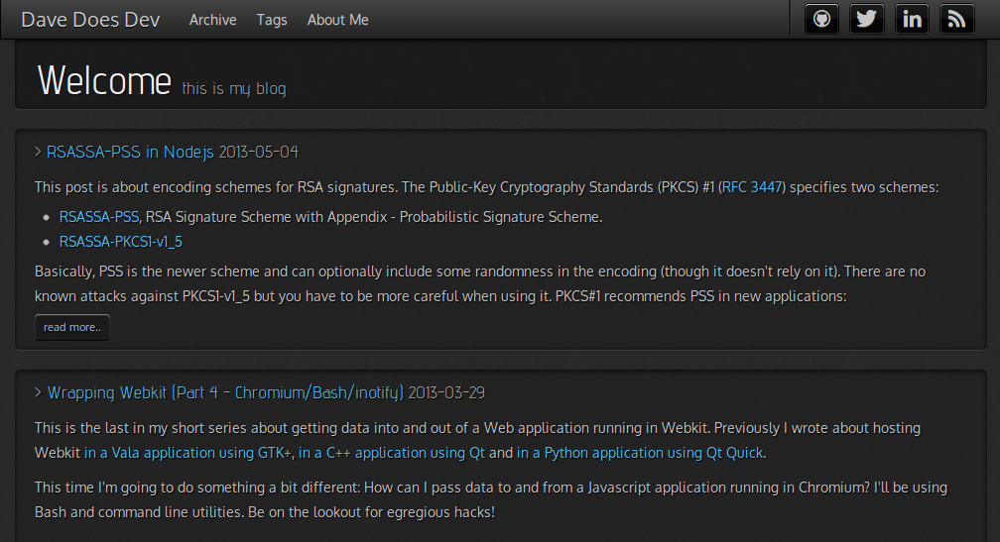

This is a fully responsive theme for ruhoh. It is built on top of [Twitter Bootstrap](http://twitter.github.com/bootstrap/).

Compatible with ruhohSpec (Directory API) v2.1

Originally by @dhulihan, modified by @davedoesdev.

<http://ruhoh.com> for more information.



## Installation

- `git clone` or download the hooligan folder into the root of your blog.

- in `config.yml`

```
hooligan:
  use: "theme"
  exclude: ["\\.sh$", "screenshot.png", "manifest.json", "README.md"]
```
    
- reload your development environment to see the changes.
